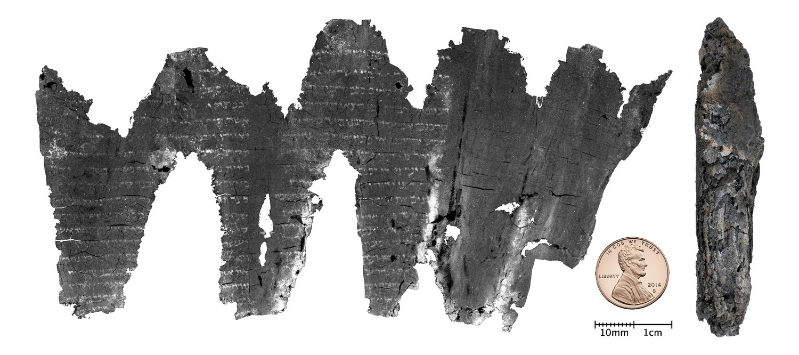

# Manuscripts of the Bible

While writing articles in the German Wikipedia in 2008 about 

## Paleographie

The style of writing letters changes over time and can be used to date a scripture rather precisely compared to C-14 dating. That is one thing I learnd when investigating the different types of scrolls

An example of how this is done can be seen in the analysis of the En-Gedi scroll and the [prelimary article about the En-Gedi scroll on archive.org](https://f-origin.hypotheses.org/wp-content/blogs.dir/1052/files/2016/09/308.En-GediTextus-26..pdf)

More about this scroll here: [https://archive.org/details/engedi-scroll](https://archive.org/details/engedi-scroll)

